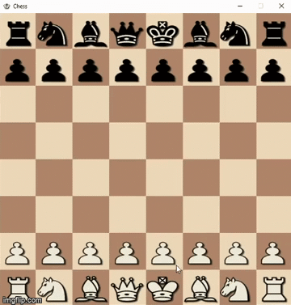

# Chess-Pygame
This project is a chess game that supports online multiplayer games as well as offline singleplayer games. This project was made with Python 3.8 along with the Pygame, Sockets and threading modules. The multiplayer mode runs a simple client-server system in which the server will handle the client connections and game management, and the client will handle the user interface and game play.

## Gameplay
This is a short demonstration of how the single-player chess game looks.

