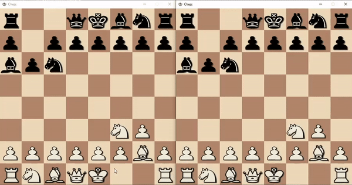

# Chess-Pygame
This project is a chess game that supports online multiplayer games as well as offline singleplayer games. This project was made with Python 3.8 along with the Pygame, Sockets and threading modules. The multiplayer mode runs a simple client-server system in which the server will handle the client connections and game management, and the client will handle the user interface and game play.

## Installation

### Windows:

#### Single-Player:
1. Ensure that you have _python_ and _pip_ installed on your machine. You can install from here: https://www.python.org/downloads/
2. Use the following command in command prompt to install _Pygame_: `pip install pygame`
3. Clone this repository to a local directory or download it as a zip and unzip it.
4. For the single-player game open the command prompt and _cd_ to the _single-plyaer_ folder.
5. Use the following command in command prompt to begin the game: `python Chess.py`

#### Multi-Player:
1. Ensure that you have _python_ and _pip_ installed on your machine. You can install from here: https://www.python.org/downloads/
2. Use the following command in command prompt to install _Pygame_: `pip install pygame`
3. Clone this repository to a local directory or download it as a zip and unzip it.
4. For the multi-player game open the command prompt and _cd_ to the _multi-player_ folder.
5. You will have to change the server address in the `server.py` and `network.py` files to the IPv4 address of the machine you will run the server script on.
6. You can now run an instance of the `server.py` file on a machine.
7. Copy the _multi-player_ folder on to two machines and run an instnace of the `client.py` file on both machines to play online chess.

## Gameplay
This is a short demonstration of how a single-player chess game looks.

In this demonstration I am running two clients on the same machine to play a multi-player chess game.

